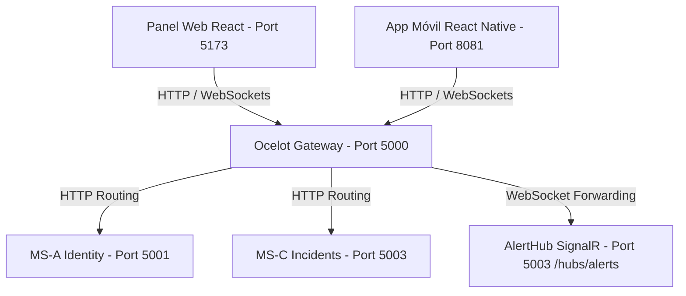

# PLAN DE IMPLEMENTACIÓN Y ANÁLISIS FORENSE DEL PROTOTIPO
## Reingeniería Senior - Sistema de Seguridad Ciudadana UTA (Sprint 1)
**Autor:** Antigravity (Lead Backend AI Agent)  
**Destinatario:** Emilio Abril (Lead Backend Developer - EMILIOABRIL05)  
**Fecha de Creación:** 7 de mayo de 2026  
**Tecnologías:** .NET 10.0, Ocelot Gateway, SignalR (WebSockets), Clean Architecture, GitFlow  

---

> [!IMPORTANT]
> **MENSAJE PARA FUTUROS AGENTES DE IA (TRANSFERENCIA DE CONTEXTO):**  
> Este documento ha sido diseñado para servir de "Caja Negra" y guía completa de transferencia. Si continúas el desarrollo de este sprint, aquí encontrarás todo el análisis técnico del prototipo original, la arquitectura destino, la estructura de clases con nomenclatura de 3 letras del equipo y los scripts/comandos de ejecución exacta. No asumas nada; todo está especificado a continuación.

---

## 🏛️ 1. ANÁLISIS FORENSE COMPLETO DEL REPOSITORIO PROTOTIPO

Hemos auditado el código fuente del repositorio base [PrototipoAgiles](https://github.com/ManuelCusme/PrototipoAgiles) con el fin de migrar de manera idónea su comportamiento. A continuación se detallan las especificaciones técnicas encontradas.

### 1.1. Estructura de Carpetas del Prototipo Original
El prototipo original agrupa un frontend móvil, un panel administrativo y un único backend monolítico en C#:
*   `Backend/SeguridadUta.Api/`: El backend monolítico en .NET 10.0 que contiene la base de datos, autenticación y gestión de alertas.
*   `Frontend/`: Aplicación móvil desarrollada en **React Native + Expo** que consume el backend.
*   `AdminWeb/`: Panel web del administrador en **React (Vite) + Leaflet** para visualización táctica en mapa.
*   `Database.sql`: Script de base de datos para SQL Server.

---

### 1.2. Auditoría Técnica del Backend Monolítico (`SeguridadUta.Api`)

#### A. Modelo de Datos (`Models/Entities.cs`)
El prototipo maneja tres entidades principales mapeadas mediante Entity Framework Core:
1.  **`User`**:
    *   `Id` (Guid, PK)
    *   `Nombre1` (string, requerido), `Nombre2` (string, opcional)
    *   `Apellido1` (string, requerido), `Apellido2` (string, opcional)
    *   `Email` (string, requerido)
    *   `PasswordHash` (string, requerido, usando BCrypt)
    *   `BirthDate` (DateTime, requerido)
    *   `Role` (string, default "Estudiante", valores: "Admin", "Estudiante", "Guardia")
    *   `Facultad` (string, default "FISEI")
    *   `IsActive` (bool, default true)
    *   `CreatedAt` (DateTime, default UTC)
2.  **`Geofence`** (Campus/Zonas Geográficas):
    *   `Id` (Guid, PK)
    *   `Name` (string, requerido)
    *   `Latitude` (double, requerido)
    *   `Longitude` (double, requerido)
    *   `Radius` (double, requerido, en metros)
3.  **`Incident`** (Emergencias disparadas):
    *   `Id` (Guid, PK)
    *   `UserId` (Guid, FK -> Users)
    *   `Latitude` (double), `Longitude` (double)
    *   `GeofenceName` (string, opcional)
    *   `Motivo` (string, default "Emergencia")
    *   `Timestamp` (DateTime, default UTC)

#### B. Controladores y Lógica de Negocio
*   **`AuthController.cs`**:
    *   `POST /api/auth/register`: Registra usuarios. Realiza validación de edad obligatoria (> 13 años) y hashea contraseñas con `BCrypt.Net.BCrypt.HashPassword`.
    *   `POST /api/auth/login`: Autentica credenciales mediante BCrypt. Genera un token JWT firmado que expira en 7 días conteniendo los claims: `NameIdentifier` (ID), `Email`, `Role` y `NombreCompleto`.
*   **`IncidentController.cs`**:
    *   `POST /api/incident/panic` (Protegido por `[Authorize]`): Extrae el ID de usuario del JWT. Registra el incidente calculando la geocerca correspondiente mediante la fórmula de Haversine (`GetDistance` a nivel del controlador). Notifica a través de SignalR a todos los clientes enviando: Nombre Completo del usuario, Coordenadas, Nombre de Geocerca, Motivo de Alerta y Facultad del usuario.
    *   `GET /api/incident/geofences` (`[AllowAnonymous]`): Retorna el listado de geocercas activas.

#### C. Comunicación en Tiempo Real (`Hubs/AlertHub.cs`)
*   Define el hub SignalR básico heredando de `Hub`.
*   Método `SendAlert(string userName, string location, string geofence)` que simplemente retransmite de forma posicional a todos los clientes conectados mediante `Clients.All.SendAsync("ReceiveAlert", ...)`.
*   *Problema grave identificado:* Falta de tipado fuerte y orden propenso a errores en el frontend al recibir los parámetros.

#### D. Inicialización y Base de Datos (`Program.cs` del Prototipo)
*   **Base de datos:** Utiliza SQL Server Local.
*   **Seeding Automático destructivo:** En cada arranque, ejecuta `context.Database.EnsureDeleted()` and `EnsureCreated()`, borrando y recreando la base de datos de manera radical.
*   **Usuarios precargados (DITIC Simulation):**
    *   `admin@uta.edu.ec` (Contraseña: `admin123`, Rol: `Admin`)
    *   5 Estudiantes: `estudiante1@uta.edu.ec` hasta `estudiante5@uta.edu.ec` (Contraseña: `123456`)
    *   5 Guardias: `guardia1@uta.edu.ec` hasta `guardia5@uta.edu.ec` (Contraseña: `123456`)
*   **Geocercas sembradas:**
    1.  *Campus Huachi* (Latitud: -1.2692, Longitud: -78.6242, Radio: 500m)
    2.  *Campus Ingahurco* (Latitud: -1.2422, Longitud: -78.6251, Radio: 300m)
    3.  *Facultad Sistemas* (Latitud: -1.2655, Longitud: -78.6210, Radio: 100m)

---

### 1.3. Limitaciones del Prototipo que Resolvemos en el Sprint 1
1.  **Arquitectura Acoplada:** La base de datos, la autenticación y la lógica de incidentes están en una sola API.
2.  **CORS Restringido:** El monolito original solo tiene políticas de CORS para `localhost:5173`. Provoca fallos de conectividad en entornos móviles reales (Metro Bundler en puerto `8081` o IPs locales de emuladores android `10.0.2.2`).
3.  **Firma Insegura de SignalR:** Al usar parámetros posicionales en el Hub, cualquier adición de campos rompe la compatibilidad del frontend React y React Native.
4.  **Ausencia de Monitoreo:** Sin endpoints de salud (`HealthCheck`) que indiquen si la infraestructura responde.

---

## 🛠️ 2. STACK TECNOLÓGICO Y ESTÁNDARES DEL PROYECTO PROFESIONAL

*   **Lenguaje y Framework:** C# con **.NET 10.0 Web API**.
*   **Gateway:** Ocelot Gateway en puerto **5000** (Capa unificada de entrada).
*   **Real-Time:** SignalR (WebSockets) integrado.
*   **Arquitectura:** Microservicios acoplados bajo principios de Clean Architecture.
*   **Nomenclatura Estricta del Equipo:** Atributos de clases, modelos de datos, DTOs y entidades deben usar la convención **prefijo de 3 letras + CamelCase**:
    *   *Ejemplos:* `usuNombre` (Usuario), `incLatitud` (Incidente), `zonDescripcion` (Geocerca/Zona), `altMensaje` (Alerta).
*   **Idioma:** Comentarios de código, logs e interfaces desarrollados **estrictamente en español**.

---

## 🚦 3. CONFIGURACIÓN DE ENTORNO (FLUJO SCRUM PROFESIONAL)

El desarrollador **Emilio Abril** configurará su entorno local mediante la siguiente secuencia de comandos en PowerShell o Git Bash en el directorio raíz:

### 3.1. Configuración de Identidad Git
```powershell
# 1. Identidad de Autoría en el Repositorio Destino
git config user.name "EMILIOABRIL05"
git config user.email "alexanderabril552@gmail.com"
```

### 3.2. Inicialización de GitFlow Profesional
```powershell
# 2. Inicializar GitFlow con ramas estándar (main para producción, develop para integración)
git flow init -d

# 3. Crear e iniciar la primera rama de trabajo para la Tarea A (API Gateway)
git flow feature start SCRUM-1-api-gateway
```

### 3.3. Reglas de Commits y Entrega (Crucial)
1.  **Commits Semánticos Obligatorios:** Los commits deben empezar con el código del ticket de Jira relacionado:
    *   `git commit -m "[SCRUM-1] feat: configuración base de ocelot gateway y endpoints de salud"`
    *   `git commit -m "[SCRUM-4] feat: implementación de alerthub signalr con dto tipado"`
2.  **Políticas de Entrega Sin "Finish" Local:** **NO** usar `git flow feature finish` localmente. Para entregar las tareas, el desarrollador Emilio Abril subirá las ramas de características al repositorio central y creará un Pull Request:
    *   `git push origin feature/SCRUM-1-api-gateway`
    *   `git push origin feature/SCRUM-4-signalr-hub`

---

## 📐 4. ARQUITECTURA DE MICROSERVICIOS DESTINO (SPRINT 1)

Durante este sprint, se creará el API Gateway como fachada y el Microservicio de Incidentes para procesar alertas en tiempo real.



---

## 📝 5. CÓDIGO COMPLETO Y PASOS DE IMPLEMENTACIÓN

### TAREAA: [SCRUM-1] Setup del API Gateway (`UtaSecurity.Gateway`)
Crea la puerta de enlace única que recibe las peticiones, procesa políticas globales de CORS y enruta hacia los puertos internos de los microservicios.

#### Paso A.1: Creación del Proyecto
Ejecuta en tu consola dentro del directorio del nuevo repositorio:
```powershell
# Crear estructura física
mkdir src -Force
cd src

# Crear proyecto de Gateway .NET 10
dotnet new web -n UtaSecurity.Gateway --framework "net10.0"
cd UtaSecurity.Gateway

# Instalar Ocelot
dotnet add package Ocelot
```

#### Paso A.2: Archivo [Program.cs](file:///d:/SistemaSeguridad/src/UtaSecurity.Gateway/Program.cs)
```csharp
// PROGRAM.CS — UTASECURITY.GATEWAY
// Desarrollado bajo .NET 10.0 - Clean Architecture
// Propósito: API Gateway centralizado para enrutar tráfico HTTP y WebSockets

using Ocelot.DependencyInjection;
using Ocelot.Middleware;

var builder = WebApplication.CreateBuilder(args);

// --- POLÍTICA DE CORS GLOBAL ---
// Diseñado para desarrollo móvil y web. Permite React y React Native sin errores de conectividad.
builder.Services.AddCors(options =>
{
    options.AddPolicy("GlobalCorsPolicy", policy =>
    {
        policy.WithOrigins(
                "http://localhost:5173",       // Frontend React Web
                "http://localhost:8081",       // React Native Metro Bundler
                "http://10.0.2.2:8081"         // Emulador Android local
            )
            .AllowAnyMethod()
            .AllowAnyHeader()
            .AllowCredentials();               // Indispensable para negociar conexiones SignalR
    });
});

// --- CARGAR CONFIGURACIÓN DE OCELOT ---
builder.Configuration.AddJsonFile("ocelot.json", optional: false, reloadOnChange: true);

// --- REGISTRAR SERVICIOS DE OCELOT ---
builder.Services.AddOcelot(builder.Configuration);

var app = builder.Build();

// Aplicar CORS global
app.UseCors("GlobalCorsPolicy");

// --- ENDPOINT DE SALUD (HEALTH CHECK) ---
// Retorna el JSON requerido para el monitoreo de infraestructura
app.MapGet("/health", () => Results.Json(new
{
    status = "Healthy",
    timestamp = DateTime.UtcNow.ToString("o"),  // Formato ISO 8601 de precisión
    service = "Gateway"
}));

// --- INTEGRAR MIDDLEWARE OCELOT ---
await app.UseOcelot();

app.Run();
```

#### Paso A.3: Configuración [ocelot.json](file:///d:/SistemaSeguridad/src/UtaSecurity.Gateway/ocelot.json)
```json
{
  "Routes": [
    {
      "DownstreamPathTemplate": "/api/identity/{everything}",
      "DownstreamScheme": "http",
      "DownstreamHostAndPorts": [
        { "Host": "localhost", "Port": 5001 }
      ],
      "UpstreamPathTemplate": "/api/identity/{everything}",
      "UpstreamMethods": [ "Get", "Post", "Put", "Delete", "Options" ]
    },
    {
      "DownstreamPathTemplate": "/api/incidents/{everything}",
      "DownstreamScheme": "http",
      "DownstreamHostAndPorts": [
        { "Host": "localhost", "Port": 5003 }
      ],
      "UpstreamPathTemplate": "/api/incidents/{everything}",
      "UpstreamMethods": [ "Get", "Post", "Put", "Delete", "Options" ]
    },
    {
      "DownstreamPathTemplate": "/hubs/alerts",
      "DownstreamScheme": "ws",
      "DownstreamHostAndPorts": [
        { "Host": "localhost", "Port": 5003 }
      ],
      "UpstreamPathTemplate": "/hubs/alerts",
      "UpstreamMethods": [ "Get", "Post" ]
    }
  ],
  "GlobalConfiguration": {
    "BaseUrl": "http://localhost:5000"
  }
}
```

---

### TAREA B: [SCRUM-4] Hub SignalR y Microservicio de Incidentes (`UtaSecurity.Services.Incidents`)
Gestiona el endpoint de pánico y transmite la información tipada de incidentes a través del WebSocket.

#### Paso B.1: Creación del Proyecto
```powershell
# Volver a src/
cd ..

# Crear Web API de Incidentes
dotnet new webapi -n UtaSecurity.Services.Incidents --framework "net10.0"
cd UtaSecurity.Services.Incidents
```

#### Paso B.2: Modelo de Datos [IncidentDto.cs](file:///d:/SistemaSeguridad/src/UtaSecurity.Services.Incidents/Models/IncidentDto.cs)
Aplica de manera estricta la nomenclatura del equipo (`inc` + CamelCase):
```csharp
// INCIDENTDTO.CS — MODELO DE TRANSFERENCIA DE DATOS
// Aplicando convención del equipo: prefijo 'inc' + CamelCase

namespace UtaSecurity.Services.Incidents.Models
{
    /// <summary>
    /// Modelo de datos estructurado para transferencia y notificación en tiempo real de emergencias.
    /// </summary>
    public class IncidentDto
    {
        // incId: Clave única identificadora del incidente de seguridad
        public string incId { get; set; } = Guid.NewGuid().ToString();

        // incMotivo: Causa de la alerta (Robo, Accidente, Acoso, etc.)
        public string incMotivo { get; set; } = "Emergencia";

        // incLatitud: Ubicación latitud de la alerta
        public double incLatitud { get; set; }

        // incLongitud: Ubicación longitud de la alerta
        public double incLongitud { get; set; }

        // incGeocercaNombre: Campus o zona táctica asignada (Z1-Z4 del Campus UTA)
        public string incGeocercaNombre { get; set; } = "Ubicación desconocida";

        // incReportadoPor: Nombre completo del estudiante o guardia que reporta
        public string incReportadoPor { get; set; } = string.Empty;

        // incFacultad: Facultad del reportante
        public string incFacultad { get; set; } = "FISEI";

        // incSeveridad: Criticidad de la alerta (Bajo, Medio, Alto, Crítico)
        public string incSeveridad { get; set; } = "Medio";

        // incFechaReporte: Fecha y hora exacta de emisión en formato UTC
        public DateTime incFechaReporte { get; set; } = DateTime.UtcNow;
    }
}
```

#### Paso B.3: Hub SignalR [AlertHub.cs](file:///d:/SistemaSeguridad/src/UtaSecurity.Services.Incidents/Hubs/AlertHub.cs)
```csharp
// ALERTHUB.CS — SIGNALR WEBOCKETS
// Transmite alertas utilizando el modelo de datos tipado en lugar de parámetros sueltos

using Microsoft.AspNetCore.SignalR;
using UtaSecurity.Services.Incidents.Models;

namespace UtaSecurity.Services.Incidents.Hubs
{
    /// <summary>
    /// Gestiona las conexiones WebSockets de los guardias y el mapa administrativo.
    /// </summary>
    public class AlertHub : Hub
    {
        /// <summary>
        /// Difunde un incidente de seguridad a todos los usuarios/vigilantes activos en la red.
        /// </summary>
        /// <param name="objIncidente">Instancia DTO de incidente con nomenclatura estándar.</param>
        public async Task BroadcastAlert(IncidentDto objIncidente)
        {
            // Transmitir al manejador cliente de 'ReceiveAlert'
            await Clients.All.SendAsync("ReceiveAlert", objIncidente);
        }

        public override async Task OnConnectedAsync()
        {
            await base.OnConnectedAsync();
        }
    }
}
```

#### Paso B.4: Controlador [IncidentsController.cs](file:///d:/SistemaSeguridad/src/UtaSecurity.Services.Incidents/Controllers/IncidentsController.cs)
```csharp
// INCIDENTSCONTROLLER.CS — ENDPOINT DE ENTRADA HTTP POST
// Recibe alertas y las despacha de forma reactiva al Hub de SignalR

using Microsoft.AspNetCore.Mvc;
using Microsoft.AspNetCore.SignalR;
using UtaSecurity.Services.Incidents.Hubs;
using UtaSecurity.Services.Incidents.Models;

namespace UtaSecurity.Services.Incidents.Controllers
{
    [ApiController]
    [Route("api/[controller]")]
    public class IncidentsController : ControllerBase
    {
        private readonly IHubContext<AlertHub> _hubContext;

        public IncidentsController(IHubContext<AlertHub> hubContext)
        {
            _hubContext = hubContext;
        }

        /// <summary>
        /// Registra un nuevo incidente de seguridad e inmediatamente lo difunde por WebSocket.
        /// </summary>
        [HttpPost]
        public async Task<IActionResult> PostIncident([FromBody] IncidentDto objNuevaAlerta)
        {
            // Validación de coordenadas requeridas
            if (objNuevaAlerta.incLatitud == 0 && objNuevaAlerta.incLongitud == 0)
            {
                return BadRequest(new { error = "Se requieren coordenadas válidas (incLatitud / incLongitud)." });
            }

            // Forzar marcas de tiempo confiables del servidor
            objNuevaAlerta.incFechaReporte = DateTime.UtcNow;
            objNuevaAlerta.incId = Guid.NewGuid().ToString();

            // Despachar alerta instantánea a través del Hub WebSocket
            await _hubContext.Clients.All.SendAsync("ReceiveAlert", objNuevaAlerta);

            return Ok(new
            {
                mensaje = "Alerta de incidente procesada y transmitida exitosamente.",
                data = objNuevaAlerta
            });
        }
    }
}
```

#### Paso B.5: Archivo [Program.cs](file:///d:/SistemaSeguridad/src/UtaSecurity.Services.Incidents/Program.cs)
```csharp
// PROGRAM.CS — UTASECURITY.SERVICES.INCIDENTS
// Propósito: Servidor independiente para la lógica de incidentes y SignalR

using UtaSecurity.Services.Incidents.Hubs;

var builder = WebApplication.CreateBuilder(args);

// Registrar controladores del microservicio
builder.Services.AddControllers();

// Inicializar motor de SignalR para tiempo real
builder.Services.AddSignalR();

// Habilitar CORS del servicio para comunicación cruzada en desarrollo
builder.Services.AddCors(options =>
{
    options.AddPolicy("ServiceCorsPolicy", policy =>
    {
        policy.WithOrigins(
                "http://localhost:5000",       // API Gateway
                "http://localhost:5173",       // React directo
                "http://localhost:8081"        // Metro Bundler directo
            )
            .AllowAnyMethod()
            .AllowAnyHeader()
            .AllowCredentials();               // Requerido por WebSockets handshake
    });
});

var app = builder.Build();

app.UseCors("ServiceCorsPolicy");
app.UseRouting();
app.UseAuthorization();

// Mapeo de Controladores
app.MapControllers();

// Mapeo del Hub WebSocket - Coincide con Ocelot
app.MapHub<AlertHub>("/hubs/alerts");

app.Run();
```

---

## 📬 6. PLANTILLA DE PULL REQUEST (GITHUB)

Utiliza la siguiente plantilla para abrir el PR en GitHub contra la rama `develop`:

```markdown
# 🚀 Reingeniería Backend - Entrega Sprint 1 (Emilio Abril)

## 📌 Tickets Vinculados
*   **[SCRUM-1]**: Setup del API Gateway
*   **[SCRUM-4]**: Hub SignalR y Microservicio de Incidentes

## 📝 Resumen Técnico de Cambios
Hemos migrado y desacoplado la lógica monolítica del prototipo original (`SeguridadUta.Api`) a una infraestructura distribuida basada en **.NET 10** y **Ocelot**:

1.  **API Gateway (UtaSecurity.Gateway):** Configurado en el puerto `5000` con `ocelot.json` resolviendo rutas hacia MS-A (Identity) en el puerto `5001` y MS-C (Incidents) en el puerto `5003`.
2.  **Soporte WebSockets:** Añadido enrutamiento `ws://` hacia el hub de alertas de SignalR en la ruta `/hubs/alerts`.
3.  **Monitoreo de Salud:** Creado endpoint `/health` en el Gateway que retorna JSON con `status`, `timestamp` en formato ISO y el `service` identificador.
4.  **CORS Global Robustecido:** Ampliada la seguridad para admitir el cliente Web React y emuladores/entornos móviles de React Native sin fallos de preflight.
5.  **SignalR Tipado Fuerte (MS Incidents):** Implementado `AlertHub.cs` transmitiendo el objeto fuertemente tipado `IncidentDto.cs` resolviendo el problema de los parámetros desordenados del prototipo.
6.  **Nomenclatura Estricta:** Propiedades del DTO renombradas con prefijo de 3 letras (`incId`, `incMotivo`, `incLatitud`, `incLongitud`, `incGeocercaNombre`, `incReportadoPor`, `incFacultad`, `incSeveridad`, `incFechaReporte`).

---

## 👥 Equipo Revisor Requerido
*   @ManuelCusme (Líder Técnico)
*   @Mateo
*   @Pablo

---

## 🧪 Pasos de Verificación Local

1.  **Compilar los Proyectos:**
    ```powershell
    dotnet build src/UtaSecurity.Gateway/UtaSecurity.Gateway.csproj
    dotnet build src/UtaSecurity.Services.Incidents/UtaSecurity.Services.Incidents.csproj
    ```
2.  **Iniciar los Servicios en Paralelo:**
    *   *Terminal 1:* `dotnet run --project src/UtaSecurity.Gateway --urls "http://localhost:5000"`
    *   *Terminal 2:* `dotnet run --project src/UtaSecurity.Services.Incidents --urls "http://localhost:5003"`
3.  **Prueba de Monitoreo:**
    *   `GET http://localhost:5000/health` debe retornar:
        `{ "status": "Healthy", "timestamp": "...", "service": "Gateway" }`
4.  **Prueba de Alerta de Pánico (Gateway Proxy):**
    *   `POST http://localhost:5000/api/incidents`
    *   *Headers:* `Content-Type: application/json`
    *   *Cuerpo:*
        ```json
        {
          "incMotivo": "Robo",
          "incLatitud": -1.2692,
          "incLongitud": -78.6242,
          "incGeocercaNombre": "Campus Huachi",
          "incReportadoPor": "Emilio Abril",
          "incFacultad": "FISEI",
          "incSeveridad": "Alto"
        }
        ```
    *   *Resultado:* Debe retornar HTTP `200 OK` y emitir el objeto a través de WebSockets en `ws://localhost:5000/hubs/alerts` hacia todos los clientes de escucha React / React Native.
```

## 📐 6. NUEVA TAREA C: [SCRUM-5] Microservicio de Identidad (`UtaSecurity.Services.Identity`)
Gestiona el registro, autenticación y generación de tokens JWT de los usuarios institucionales en el puerto **5001**.

### Paso C.1: Creación del Proyecto
```powershell
# Volver a src/
cd src/

# Crear Web API de Identidad
dotnet new webapi -n UtaSecurity.Services.Identity --framework "net10.0"
cd UtaSecurity.Services.Identity

# Instalar paquetes requeridos para seguridad y JWT
dotnet add package BCrypt.Net-Next
dotnet add package System.IdentityModel.Tokens.Jwt
dotnet add package Microsoft.IdentityModel.Tokens
```

### Paso C.2: Modelo de Datos y DTOs (`Models/UserModels.cs`)
Aplica de manera estricta la nomenclatura con el prefijo `usu` + CamelCase:
```csharp
namespace UtaSecurity.Services.Identity.Models
{
    public class UserEntity
    {
        public string usuId { get; set; } = Guid.NewGuid().ToString();
        public string usuNombre1 { get; set; } = string.Empty;
        public string? usuNombre2 { get; set; }
        public string usuApellido1 { get; set; } = string.Empty;
        public string? usuApellido2 { get; set; }
        public string usuEmail { get; set; } = string.Empty;
        public string usuPasswordHash { get; set; } = string.Empty;
        public DateTime usuBirthDate { get; set; }
        public string usuRole { get; set; } = "Estudiante"; // Admin, Estudiante, Guardia
        public string usuFacultad { get; set; } = "FISEI";
        public bool usuIsActive { get; set; } = true;
        public DateTime usuCreatedAt { get; set; } = DateTime.UtcNow;
    }

    public class UserRegisterDto
    {
        public string usuNombre1 { get; set; } = string.Empty;
        public string? usuNombre2 { get; set; }
        public string usuApellido1 { get; set; } = string.Empty;
        public string? usuApellido2 { get; set; }
        public string usuEmail { get; set; } = string.Empty;
        public string usuPassword { get; set; } = string.Empty;
        public DateTime usuBirthDate { get; set; }
        public string usuFacultad { get; set; } = "FISEI";
    }

    public class UserLoginDto
    {
        public string usuEmail { get; set; } = string.Empty;
        public string usuPassword { get; set; } = string.Empty;
    }

    public class UserAuthResponseDto
    {
        public string usuToken { get; set; } = string.Empty;
        public string usuId { get; set; } = string.Empty;
        public string usuNombreCompleto { get; set; } = string.Empty;
        public string usuEmail { get; set; } = string.Empty;
        public string usuRole { get; set; } = string.Empty;
        public string usuFacultad { get; set; } = string.Empty;
    }
}
```

### Paso C.3: Controlador de Autenticación (`Controllers/IdentityController.cs`)
```csharp
using Microsoft.AspNetCore.Mvc;
using Microsoft.IdentityModel.Tokens;
using System.IdentityModel.Tokens.Jwt;
using System.Security.Claims;
using System.Text;
using UtaSecurity.Services.Identity.Models;

namespace UtaSecurity.Services.Identity.Controllers
{
    [ApiController]
    [Route("api/[controller]")]
    public class IdentityController : ControllerBase
    {
        // Almacenamiento estático en memoria para simular base de datos persistente (Sprint 1)
        private static readonly List<UserEntity> _usuariosBD = new();
        private readonly IConfiguration _config;
        private const string SecretKey = "SuperSecretSecurityKeyForUtaSecuritySystem2026"; // Clave desarrollo

        public IdentityController(IConfiguration config)
        {
            _config = config;
            // Sembrar usuarios iniciales (Seeding) si la lista está vacía
            if (!_usuariosBD.Any())
            {
                SeedUsers();
            }
        }

        [HttpPost("register")]
        public IActionResult Register([FromBody] UserRegisterDto dto)
        {
            if (string.IsNullOrEmpty(dto.usuEmail) || string.IsNullOrEmpty(dto.usuPassword))
            {
                return BadRequest(new { error = "El email y la contraseña son requeridos." });
            }

            // Validar si el correo ya existe
            if (_usuariosBD.Any(u => u.usuEmail.Equals(dto.usuEmail, StringComparison.OrdinalIgnoreCase)))
            {
                return BadRequest(new { error = "El correo ya se encuentra registrado." });
            }

            // Validar edad (mayor a 13 años)
            var edad = DateTime.UtcNow.Year - dto.usuBirthDate.Year;
            if (dto.usuBirthDate > DateTime.UtcNow.AddYears(-edad)) edad--;
            if (edad < 13)
            {
                return BadRequest(new { error = "La edad mínima de registro es de 13 años." });
            }

            var nuevoUsuario = new UserEntity
            {
                usuNombre1 = dto.usuNombre1,
                usuNombre2 = dto.usuNombre2,
                usuApellido1 = dto.usuApellido1,
                usuApellido2 = dto.usuApellido2,
                usuEmail = dto.usuEmail,
                usuPasswordHash = BCrypt.Net.BCrypt.HashPassword(dto.usuPassword),
                usuBirthDate = dto.usuBirthDate,
                usuRole = "Estudiante", // Rol predeterminado
                usuFacultad = dto.usuFacultad
            };

            _usuariosBD.Add(nuevoUsuario);

            return Ok(new { mensaje = "Usuario registrado exitosamente." });
        }

        [HttpPost("login")]
        public IActionResult Login([FromBody] UserLoginDto dto)
        {
            var usuario = _usuariosBD.FirstOrDefault(u => u.usuEmail.Equals(dto.usuEmail, StringComparison.OrdinalIgnoreCase));
            if (usuario == null || !BCrypt.Net.BCrypt.Verify(dto.usuPassword, usuario.usuPasswordHash))
            {
                return Unauthorized(new { error = "Credenciales incorrectas." });
            }

            if (!usuario.usuIsActive)
            {
                return BadRequest(new { error = "La cuenta está desactivada." });
            }

            // Generación de Token JWT
            var tokenHandler = new JwtSecurityTokenHandler();
            var key = Encoding.UTF8.GetBytes(SecretKey);
            var nombreCompleto = $"{usuario.usuNombre1} {usuario.usuApellido1}".Trim();

            var tokenDescriptor = new SecurityTokenDescriptor
            {
                Subject = new ClaimsIdentity(new[]
                {
                    new Claim(ClaimTypes.NameIdentifier, usuario.usuId),
                    new Claim(ClaimTypes.Email, usuario.usuEmail),
                    new Claim(ClaimTypes.Role, usuario.usuRole),
                    new Claim("NombreCompleto", nombreCompleto),
                    new Claim("Facultad", usuario.usuFacultad)
                }),
                Expires = DateTime.UtcNow.AddDays(7), // Expira en 7 días
                SigningCredentials = new SigningCredentials(new SymmetricSecurityKey(key), SecurityAlgorithms.HmacSha256Signature)
            };

            var token = tokenHandler.CreateToken(tokenDescriptor);
            var tokenString = tokenHandler.WriteToken(token);

            return Ok(new UserAuthResponseDto
            {
                usuToken = tokenString,
                usuId = usuario.usuId,
                usuNombreCompleto = nombreCompleto,
                usuEmail = usuario.usuEmail,
                usuRole = usuario.usuRole,
                usuFacultad = usuario.usuFacultad
            });
        }

        private static void SeedUsers()
        {
            // 1 Admin
            _usuariosBD.Add(new UserEntity
            {
                usuId = Guid.NewGuid().ToString(),
                usuNombre1 = "Administrador",
                usuApellido1 = "Central",
                usuEmail = "admin@uta.edu.ec",
                usuPasswordHash = BCrypt.Net.BCrypt.HashPassword("admin123"),
                usuRole = "Admin",
                usuFacultad = "DITIC"
            });

            // 5 Estudiantes
            for (int i = 1; i <= 5; i++)
            {
                _usuariosBD.Add(new UserEntity
                {
                    usuId = Guid.NewGuid().ToString(),
                    usuNombre1 = "Estudiante",
                    usuApellido1 = i.ToString(),
                    usuEmail = $"estudiante{i}@uta.edu.ec",
                    usuPasswordHash = BCrypt.Net.BCrypt.HashPassword("123456"),
                    usuRole = "Estudiante",
                    usuFacultad = "FISEI"
                });
            }

            // 5 Guardias
            for (int i = 1; i <= 5; i++)
            {
                _usuariosBD.Add(new UserEntity
                {
                    usuId = Guid.NewGuid().ToString(),
                    usuNombre1 = "Guardia",
                    usuApellido1 = i.ToString(),
                    usuEmail = $"guardia{i}@uta.edu.ec",
                    usuPasswordHash = BCrypt.Net.BCrypt.HashPassword("123456"),
                    usuRole = "Guardia",
                    usuFacultad = "Seguridad"
                });
            }
        }
    }
}
```

### Paso C.4: Configuración `Program.cs` del Microservicio de Identidad
Configura la inyección de controladores, CORS y mapeo en el puerto **`5001`**.
```csharp
var builder = WebApplication.CreateBuilder(args);

builder.Services.AddControllers();

// Política de CORS compatible con móvil y web
builder.Services.AddCors(options =>
{
    options.AddPolicy("IdentityCorsPolicy", policy =>
    {
        policy.WithOrigins(
                "http://localhost:5000", // API Gateway
                "http://localhost:5173", // React Web
                "http://localhost:8081"  // React Native Metro
            )
            .AllowAnyMethod()
            .AllowAnyHeader()
            .AllowCredentials();
    });
});

var app = builder.Build();

app.UseCors("IdentityCorsPolicy");
app.UseRouting();
app.UseAuthorization();

app.MapControllers();

app.Run();
```

Fijar puerto `5001` por defecto en su `launchSettings.json`.

---

## 📂 7. NUEVA TAREA D: [SCRUM-6] Creación de Solución Unificada (.sln)
Consolida el repositorio organizando todos los servicios bajo una única solución de Visual Studio para una carga masiva simple:

```powershell
# En la raíz del repositorio d:\SistemaSeguridad
dotnet new sln -n UtaSecurity

# Agregar los tres proyectos a la solución
dotnet sln UtaSecurity.sln add src/UtaSecurity.Gateway/UtaSecurity.Gateway.csproj
dotnet sln UtaSecurity.sln add src/UtaSecurity.Services.Incidents/UtaSecurity.Services.Incidents.csproj
dotnet sln UtaSecurity.sln add src/UtaSecurity.Services.Identity/UtaSecurity.Services.Identity.csproj
```

---

## 🔍 8. VERIFICACIÓN FINAL DEL SPRINT 1 (COMPLETO)

Con esta ampliación, el flujo extremo a extremo puede ser verificado de la siguiente manera:

1.  **Ejecución de Servicios (Consola o Visual Studio):**
    *   Ejecutar API Gateway (Puerto 5000)
    *   Ejecutar Microservicio de Identidad (Puerto 5001)
    *   Ejecutar Microservicio de Incidentes (Puerto 5003)
2.  **Verificación de Login en Gateway Proxy:**
    *   `POST http://localhost:5000/api/identity/login`
    *   *Cuerpo:* `{"usuEmail": "admin@uta.edu.ec", "usuPassword": "admin123"}`
    *   *Resultado:* Retorna `200 OK` con un JWT válido firmado con claims y datos estructurados usando el prefijo `usu`.
3.  **Verificación de Alertas en Tiempo Real:**
    *   Mismo flujo implementado en la Tarea B.

